# Tim's Woodworks Website Overview

Tim's Woodworks is a site for people seeking to Enquire to woodworking
and cabinetmaking courses, be they a beginner, a hobbyist or a professional 
looking to upgrade their skills. Tim's Woodworks will be useful for potential
customers to see available courses, and reserve a spot on a course as well as seeing
Tim's skills and abilities as an experienced craftsperson.

## Features

### Existing Features

**Navigation Bar**

* This is featured on all four webpages, is fully responsive which includes the logo providing a link to the hompage, links to the 
homepage, workshops, gallery, sign-up pages and is identical in each page to allow cohesive navigating.

**Banner with Hero Image**

* This is featured on the home page, it is a simple image of someone demonstrating woodworking techniques and over the image, the text for the website slides across.

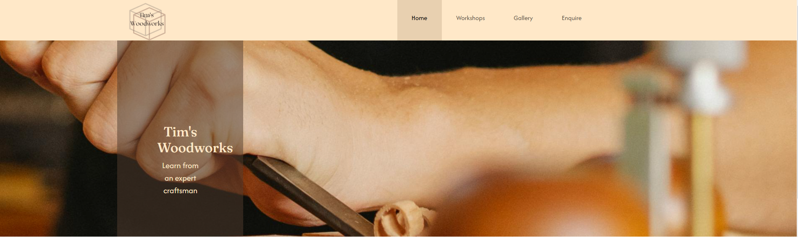

**Available Courses as Cards**

* Using the Bootstrap CSS for the cards with a few adjustments on the home page, this section neatly displays the upcoming courses in woodworking and 
cabinetmaking at a glance where the interested customer can click on the button to go to the workshop html page to receive further
information. This is on a responsive grid system. 

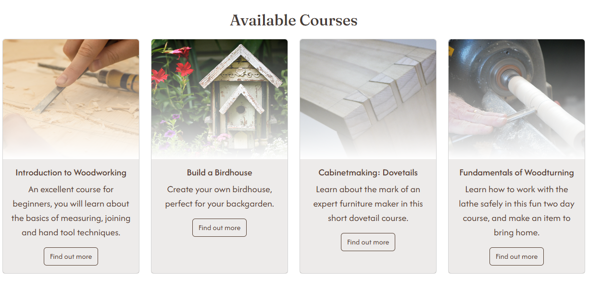

**Testimonials**

* The testimonials on the home page are displayed in a dynamic manner by the Bootstrap carousel feature. The timing is long enough to allow the end-user to read
the testimonial about the courses and flicks through automatically so the end-user does not have to click through.

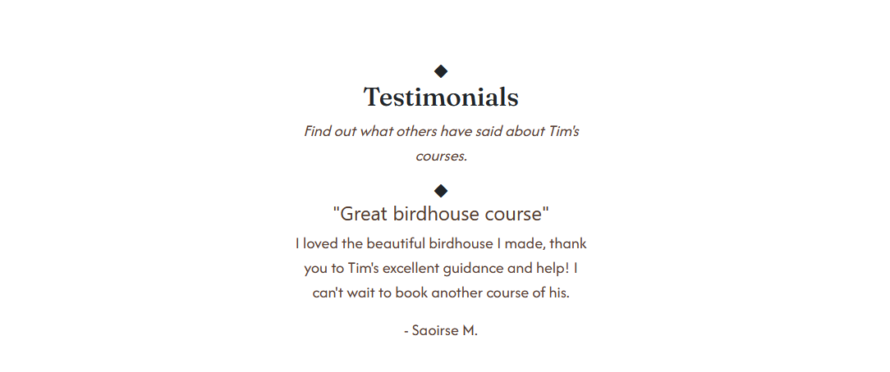

**Footer section**

* This is featured on all four webpages, and contains social media links represented by icons, an email address, a phone number. In the middle, is a logo of the website. 

**Gallery**

* The gallery features some of the objects that Tim has crafted with a small description on the bottom-right of each picture so the user can easily read what they are.

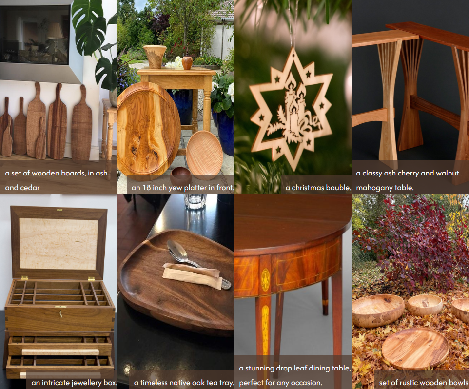

**Form** 

* The form is simple and easy to fill out, with personal information such as name, email, and phone required so we can get back in touch with enquiries. 

**Enquiry Confirmation**

* This page appears when an enquiry is successfully submitted, letting the user know we'll get in touch soon.

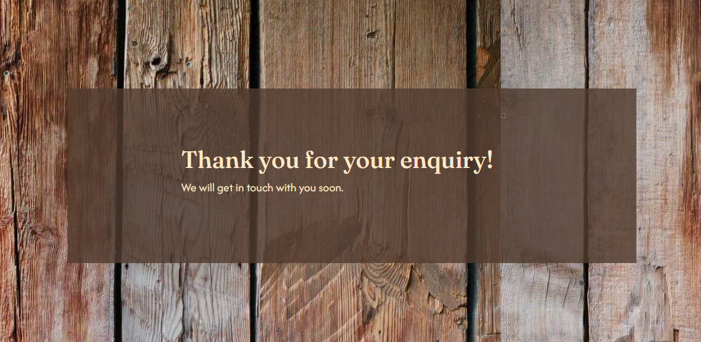

## UX 

The aim of Tim's Woodworks is to offer interested customers a range of woodworking and cabinetmaking courses with information on what they will 
learn, the course duration and prices. Interested customers should be able to see testimonials vouching for the courses and their value for money. 
The site should be easy to navigate, aesthetically pleasing and easy for customers to find the information they need. 

### User Stories 

**As a Customer:**

*I want to be able to quickly see what courses are available.
* I want to be able to easily navigate through the webpages of the website.
* I want to be able to see the contact information on all webpages without having to go back to the homepage.
* I want to be able to see how much a course costs.
* I want to be able to book a spot in one of the available courses. 
* I want to be able to see testimonials to ensure the course is right for me.

### Design Choices 

#### Colour Scheme

The website's primary colours are in a wood-based palette, using the main colours: #513B2E #FFE8C8 #B49777 #573F35.

[WebAIM](https://webaim.org/resources/contrastchecker/) was used for accessibility purposes to look at the contrast of the colours against each other: for instance, #513B2E as foreground #FFE8C8 as background had a contrast ratio of 8.74:1, this was used for the navigation bar. 

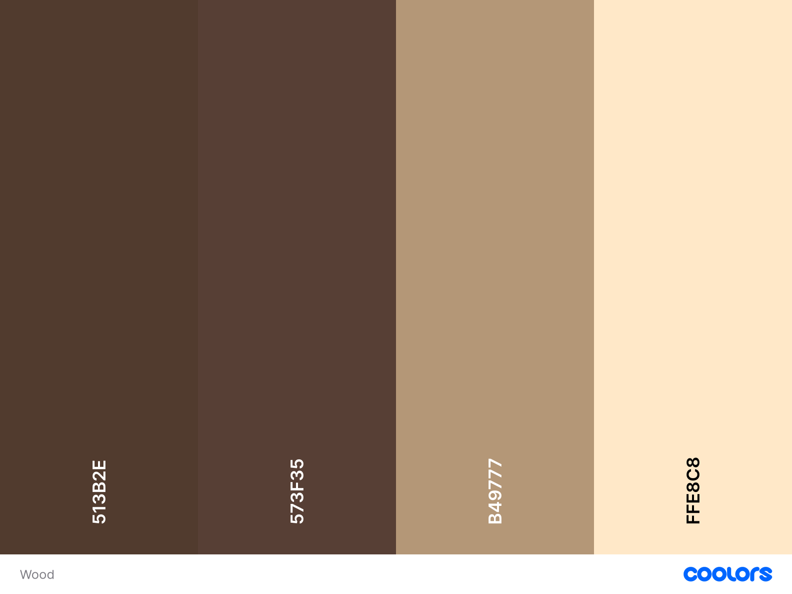

#### Typography 

Google Fonts was used to import the chosen fonts for use in the website. 

For the headings, Fraunces is the chosen font. 
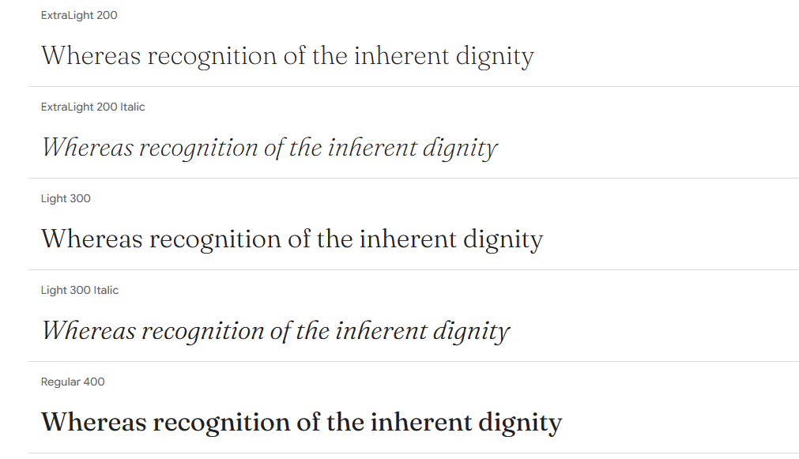

For the main body text, the font Afacad Flux was used. This is a sans-serif font which is accessible for screen readers, readers with dsylexia and other disabilities. 
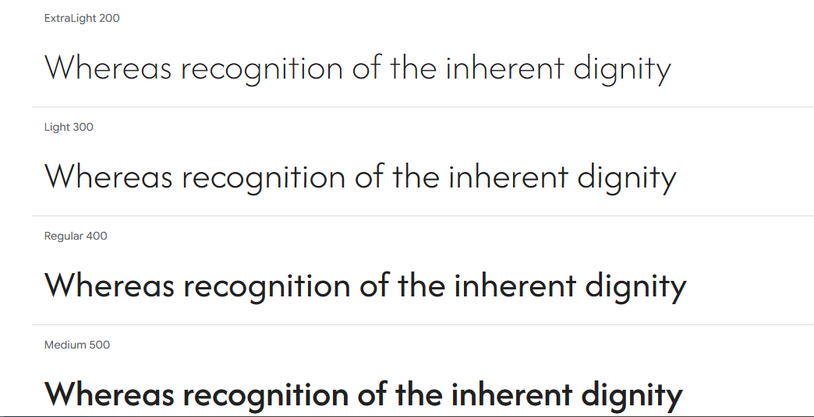

 ### Wireframes
The wireframes were created using the website Wireframe.cc for tablet, desktop and mobile. 

Wireframes are as listed below:
* **Home Page** [Desktop](https://wireframe.cc/vgawco) [Tablet](https://wireframe.cc/bvp4JK) [Mobile](https://wireframe.cc/mlVBo0) 
* **Gallery** [Desktop](https://wireframe.cc/UfeOIv) [Tablet](https://wireframe.cc/eMkP4q) [Mobile](https://wireframe.cc/Lkd1Bg)
* **Workshop** [Desktop](https://wireframe.cc/DMe4PU) [Tablet](https://wireframe.cc/etnUFP) [Mobile](https://wireframe.cc/t6s6dB)
* **Enquire** [Desktop](https://wireframe.cc/lpMVxV) [Tablet](https://wireframe.cc/mDcW2n) [Mobile](https://wireframe.cc/iR1wtQ)

## Technologies Used
#### Languages Used

HTML, CSS, Javascript

#### Frameworks, Libraries and Programs Used

* Git - for version control.
* Github - to save and store files for the website. 
* Coolors - to show the colour palette for the website.
* Google Fonts - to import the fonts on the website.
* Font Awesome - for the iconography on the website. 
* Google Dev Tools - for troubleshooting the features and the code of the website.
* Firefox Dev Tools - for troubleshooting the features and the code of the website.
* Canva - was used to make the logos for the website. 

## Testing 

### Validation 

#### WSC Validation 

[WSC](https://validator.w3.org/) was used to validate the HTML on all pages of the website. It was also used to validate the CSS.

* Index: Pass, no errors or warnings. [https://validator.w3.org/nu/?doc=https%3A%2F%2Facmuckian.github.io%2FMilestone-Project-1%2Fgallery.html]
* Gallery: Pass, no errors or warnings. [Link for testing here](https://validator.w3.org/nu/?doc=https%3A%2F%2Facmuckian.github.io%2FMilestone-Project-1%2Fgallery.html)
* Workshop: Pass, no errors or warnings. [Link for testing here](https://validator.w3.org/nu/?doc=https%3A%2F%2Facmuckian.github.io%2FMilestone-Project-1%2Fworkshop.html)
* Sign Up: Pass, no errors or warnings. [Link for testing here](https://validator.w3.org/nu/?doc=https%3A%2F%2Facmuckian.github.io%2FMilestone-Project-1%2Fsignup.html)
* Confirmation: Pass, no errors or warnings. [Link to testing here](https://validator.w3.org/nu/?doc=https%3A%2F%2Facmuckian.github.io%2FMilestone-Project-1%2Fconfirmation.html)
### Lighthouse 

Lighthouse was used in the Chrome Developer Tools to test performance, accessibility, best practices and SEO of the website. 

#### Desktop Results

All pages achieved scores of over 90 in the four categories.
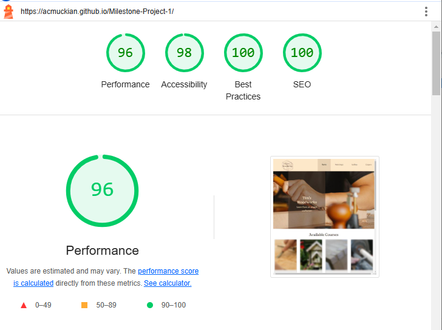
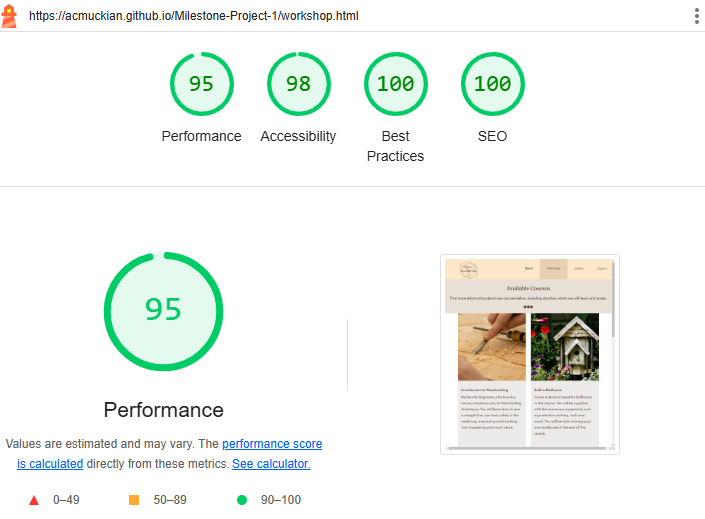
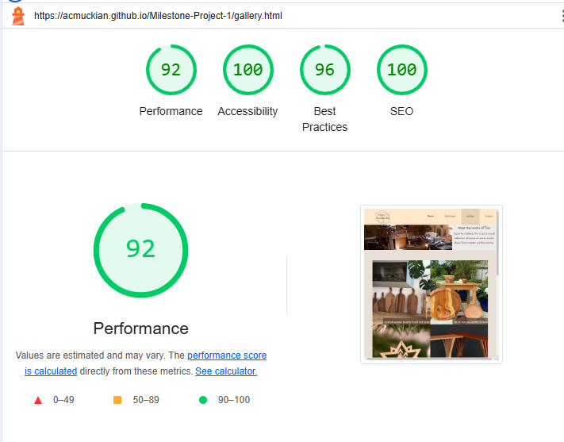

#### Mobile Results 
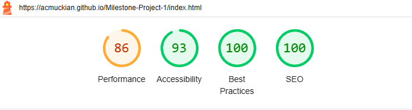
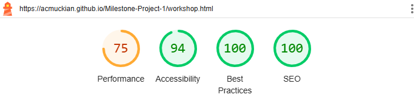
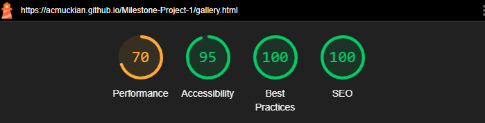
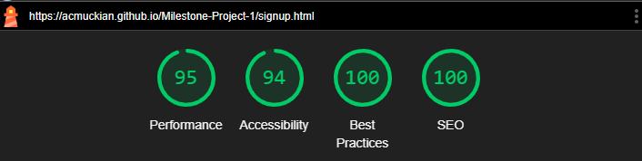
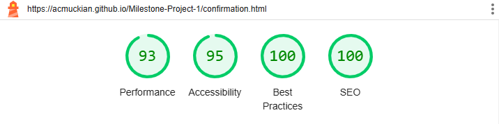

### Feature Testing  

| **Feature**                    | **Expected Outcome**                                                                           | **Testing**                  | **Result**                                | Pass/Fail |
|--------------------------------|------------------------------------------------------------------------------------------------|------------------------------|-------------------------------------------|-----------|
| Site Logo                      | Link in the logo redirects the user to the main page                                           | Clicked title on all 5 pages | Home page (re)loads                       | Pass      |
| All Navigation Bar Titles      | Links the user to the correct page, i.e clicking "gallery" brings the user to the gallery page | Clicked the titles           | Correct page loads for each title         | Pass      |
| Home page cards - hover effect | When hovered, the image should not be blurred                                                  | Hover over the card          | Image unblurs                             | Pass      |
| All Social Media Icons         | when clicked on opens the social media website in a new page                                   | click on the relevant icon   | opens the social media site in a new page | Pass      |
|                                |                                                                                                |                              |                                           |           |
#### Workshop Page 
| **Feature**                      | **Expected Outcome**                                                                           | **Testing**                  | **Result**                                | Pass/Fail |
|----------------------------------|------------------------------------------------------------------------------------------------|------------------------------|-------------------------------------------|-----------|
| Site Logo                        | Link in the logo redirects the user to the main page                                           | Clicked title on all 5 pages | Home page (re)loads                       | Pass      |
| All Navigation Bar Titles        | Links the user to the correct page, i.e clicking "gallery" brings the user to the gallery page | Clicked the titles           | Correct page loads for each title         | Pass      |
| Enquire about our courses button | when clicked on, brings the user to the enquiry page                                           | click on the button          | brings the user to the enquiry page       | Pass      |
| All Social Media Icons           | when clicked on opens the social media website in a new page                                   | click on the relevant icon   | opens the social media site in a new page | Pass      |
| Find out more button             | when clicked on opens the workshop page and the specific course                                | click on the button          | opens the course on the workshop page     | Pass      |

#### Gallery Page 

| **Feature**               | **Expected Outcome**                                                                           | **Testing**                  | **Result**                                | Pass/Fail |
|---------------------------|------------------------------------------------------------------------------------------------|------------------------------|-------------------------------------------|-----------|
| Site Logo                 | Link in the logo redirects the user to the main page                                           | Clicked title on all 5 pages | Home page (re)loads                       | Pass      |
| All Navigation Bar Titles | Links the user to the correct page, i.e clicking "gallery" brings the user to the gallery page | Clicked the titles           | Correct page loads for each title         | Pass      |
| All Social Media Icons    | when clicked on opens the social media website in a new page                                   | click on the relevant icon   | opens the social media site in a new page | Pass      |
| Find out more button      | when clicked on opens the workshop page and the specific course                                | click on the button          | opens the course on the workshop page     | Pass      |

#### Enquiry Page 

| **Feature**               | **Expected Outcome**                                                                              | **Testing**                                 | **Result**                                | Pass/Fail |
|---------------------------|---------------------------------------------------------------------------------------------------|---------------------------------------------|-------------------------------------------|-----------|
| Personal Information      | Try to submit without the name, phone no. or email, and it will require you to fill out the field | Hit submit button                           | Asks you to fill out the relevant field   | Pass      |
| Email                     | If an email address is not entered, it will ask for an email address with an @                    | enter without an email with an @            | asks to insert an email with an @         | Pass      |
| Submit                    | Opens the confirmation page                                                                       | Enter all information and hit submit button | opens the confirmation page               | Pass      |
| Site Logo                 | Link in the logo redirects the user to the main page                                              | Clicked title on all 5 pages                | Home page (re)loads                       | Pass      |
| All Navigation Bar Titles | Links the user to the correct page, i.e clicking "gallery" brings the user to the gallery page    | Clicked the titles                          | Correct page loads for each title         | Pass      |
| All Social Media Icons    | when clicked on opens the social media website in a new page                                      | click on the relevant icon                  | opens the social media site in a new page | Pass      |
| Find out more button      | when clicked on opens the workshop page and the specific course                                   | click on the button                         | opens the course on the workshop page     | Pass      |

#### Confirmation Page 

| **Feature**               | **Expected Outcome**                                                                           | **Testing**                  | **Result**                                | Pass/Fail |
|---------------------------|------------------------------------------------------------------------------------------------|------------------------------|-------------------------------------------|-----------|
| Site Logo                 | Link in the logo redirects the user to the main page                                           | Clicked title on all 5 pages | Home page (re)loads                       | Pass      |
| All Navigation Bar Titles | Links the user to the correct page, i.e clicking "gallery" brings the user to the gallery page | Clicked the titles           | Correct page loads for each title         | Pass      |
| All Social Media Icons    | when clicked on opens the social media website in a new page                                   | click on the relevant icon   | opens the social media site in a new page | Pass      |
| Find out more button      | when clicked on opens the workshop page and the specific course                                | click on the button          | opens the course on the workshop page     | Pass      |

### User Stories Testing 

* **Expectation** As a visitor, I want to know what the website is about.
* **Result** On the home page, I immediately know it is a woodworking site with woodworking courses. 

* **Expectation** As a visitor, I want to see what courses are available. 
* **Result** On the home page, I see a list of available courses and I can find out more details by clicking on them. 

* **Expectation** As a visitor, when I click on the find on more button, I can see more about that specific course. 
* **Result** When I click on the "find out more" button", I discover what next dates are available, the price, and how long the courses are on the workshop page.

* **Expectation** As a visitor, I expect to know exactly which page of the website I am on. 
* **Result** When I am on a page, the tab header states the page, and the navigation bar highlights which page I am currently on.

* **Expectation** As a visitor after I have read the courses, I want to be able to enquire about booking. 
* **Result** Below the courses on the workshops page, there is a button to click that sends me to an enquiry form. 

* **Expectation** As a visitor, when I submit my enquiry, I want to know if it has been successfully received. 
* **Result** When the form is submitted with all required information, a thank you message lets me it has been successfully received. 

### Bugs 

#### Solved Bugs 

| **Bug**                                                                                                                                   | **Solution**                                                                                                                                                                                                                                                |
|---------------------------------------------------------------------------------------------------------------------------------------|---------------------------------------------------------------------------------------------------------------------------------------------------------------------------------------------------------------------------------------------------------|
| The hero image did not fit the full width when the screen was over 1100px.                                                            | A media query for the hero image was implemented for devices over 1100px and a larger image is placed here                                                                                                                                              |
| The buttons on the card at the home page did not align with each other.                                                               | Ensuring the position was absolute in relation to the card's flexible position, and then setting the left and bottom properties so the buttons are fairly central. Media queries were used at various breakpoints.                                      |
| The navigation bar stretched over the screen at less wide breakpoints.                                                                | This was solved by using the position:absolute property and adjusting the left property at the relevant breakpoint.                                                                                                                                     |
| Only when the browser cursor hovers over the card image, the image unmasks - it does not if the cursor is on the card body.           | This was resolved by using the filter:blur property instead as it can transition so the hover pseudo-class could be applicable to both the card body and card image. So where the cursor hovers over the image and text of the card, the image unblurs. |
| The unblur effect did not work when a cursor is not used, i.e a finger on mobile devices.                                             | The media query to detect where the pointer is coarse is used instead, and the transition of the blurred image is turned off.                                                                                                                           |
| The social media links did not work properly when clicked on.                                                                         | The "https://" part of the url was missing so this was added so the link is fully functional.                                                                                                                                                           |
| The box behind the text on the navigation bar showing which page the user was on, did not fill the full height of the navigation bar. | The wrong class had been targeted - the link on <a> was selected instead of the div with the class .nav-item which meant it could only have a box around the link text and not the whole section on the navigation bar.                                 |

## Deployment 

### Deployment 

This site is deployed using GitHub Pages. Please see the deployed site [here](). To deploy using GitHub pages: 
1. Login to GitHub. 
2. Open the relevant project repository.
3. Click on "Settings" in the navigation bar under the repository title.
4. Click on "Pages" at the left-hand sidebar.
5. Under "Source", choose which branch to deploy. Main is used for this repository.
6. Choose which folder to deploy from, usually "/root".
7. Click "Save" and wait for the deployment. 
8. The URL should be displayed above "source" and on the "Code" page, on the right-hand sidebar under the "Deployments" subheading.

### Local Deployment 

The repository was also cloned for local deployment. To clone the repository: 

1. Login to Github. 
2. Go to the repository for this project: 
3. Click on the green "Code" button on the repository main page and copy the link shown.
4. Open the terminal in the code editor 
5. Clone the repository.
## Credits 

* [W3 Schools guidance on Mask-Image and Masking in CSS](https://www.w3schools.com/css/css3_masking.asp)
* [This guide on how to make a footer stay at the bottom of the webpage](https://dev.to/nehalahmadkhan/how-to-make-footer-stick-to-bottom-of-web-page-3i14)
* [W3 Schools Guide on Object-Fit Property](https://www.w3schools.com/css/css3_object-fit.asp)
* [W3 Schools Blur TryIt Editor](https://www.w3schools.com/cssref/tryit.php?filename=trycss3_filter_blur)
* [Bootstrap - Buttons](https://getbootstrap.com/docs/5.3/components/buttons/)
* [Bootstrap - Cards](https://getbootstrap.com/docs/5.3/components/card/)
* [Bootstrap - Grid](https://getbootstrap.com/docs/5.3/layout/grid/)
* [Web.Dev - Lazy Loading](https://web.dev/articles/browser-level-image-lazy-loading)
* [HTMLImageElement: decoding property](https://developer.mozilla.org/en-US/docs/Web/API/HTMLImageElement/decoding)

**Photographs:** 

* [LiCheh Pan's photograph on a dovetail](https://www.flickr.com/photos/plj/6363104049)
* [Dominik Scythe](https://unsplash.com/photos/person-using-chisel-while-curving-wood-3cIvvzjE6Lk)
* [Gary Yost](https://unsplash.com/photos/brown-wooden-birdhouse-with-red-flowers-2CAqKogS3Fk)
* [Drop Leaf Dining Table - Met Museum](https://www.metmuseum.org/art/collection/search/3172)
* [Ash Cherry and Walnut Console - Seth Rolland](https://sethrolland.com/abanico-hall-table/)
* [Ono Kosuki](https://www.pexels.com/photo/person-using-tools-in-woodworking-5974404/)
* [Tim Hamilton on Instagram](https://www.instgram.com/timhamiltoncraft)
* [Christmas Bauble - Pixabay](https://pixabay.com/zh/photos/christmas-star-christmas-tree-1108601/)